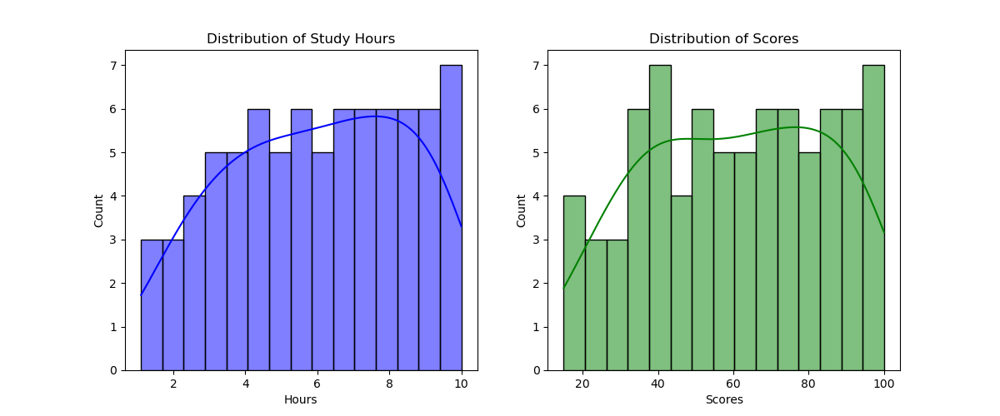
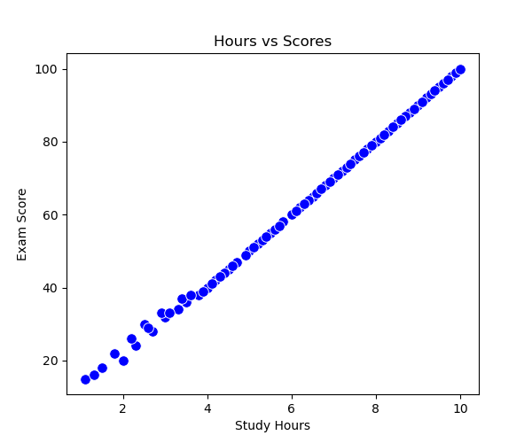
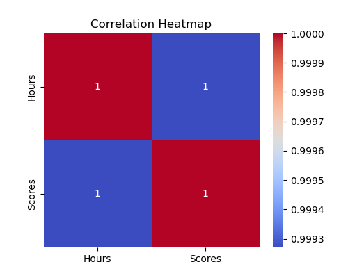
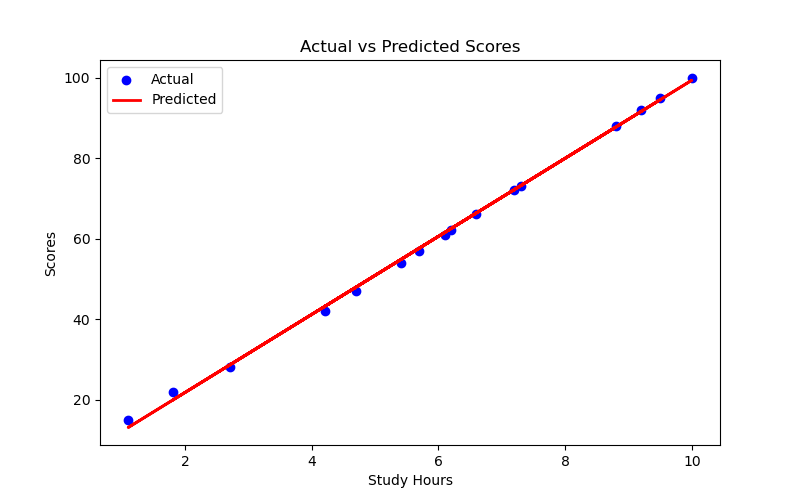
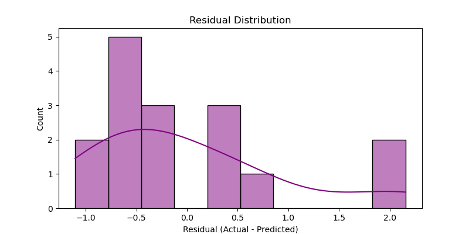
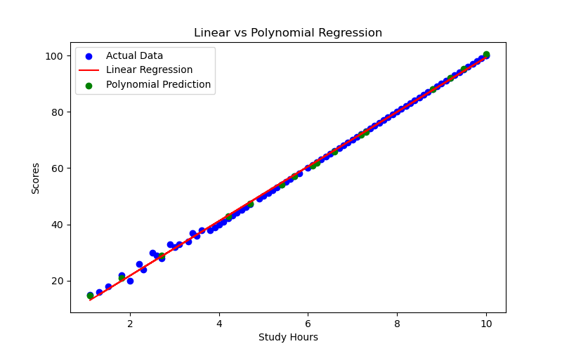

# 🎯 Student Score Predictor – Linear Regression Project

## 📌 Project Overview
This project predicts **student exam scores** based on the number of **study hours** using **Linear Regression**.  
It demonstrates an **end-to-end Machine Learning workflow**:  
✔ Data Loading & Cleaning  
✔ Exploratory Data Analysis (EDA)  
✔ Model Training & Evaluation  
✔ Prediction for User Input  
✔ Visualization & Insights  

---

## 📂 Project Structure
Student-Score-Predictor/
│
├── images/ # All saved visualizations
│ ├── actual_vs_predicted.png
│ ├── heatmap.png
│ ├── histograms.png
│ ├── linear_vs_polynomial.png
│ ├── residual_distribution.png
│ └── scatter_plot.png
│
├── student_score_predictor.ipynb # Main Jupyter Notebook
├── student_scores_large.csv # Dataset (100+ rows)
├── requirements.txt # Project dependencies
└── README.md # Documentation

---

## 📊 Dataset Details
- **File:** `student_scores_large.csv`
- **Columns:**
  - `Hours` → Study hours (1 to 10)
  - `Scores` → Exam score (0 to 100)

---

## ✅ Visualizations
| Visualization | Preview |
|--------------|---------|
| **Histograms** |  |
| **Scatter Plot** |  |
| **Correlation Heatmap** |  |
| **Actual vs Predicted** |  |
| **Residual Distribution** |  |
| **Linear vs Polynomial Regression** |  |

---

## ⚙️ How to Run the Project
1. Clone this repository:
git clone https://github.com/<your-username>/Student-Score-Predictor.git
cd Student-Score-Predictor

2. Install dependencies:
pip install -r requirements.txt

3. Open and run the Jupyter Notebook:
jupyter notebook student_score_predictor.ipynb

---

## ✅ Example Prediction
- **User Input:** `9.25 hours`  
- **Predicted Score:** `92.35 marks`

---

## 🔗 Links
- **GitHub Repository:** [your repo link here]
- **Video Explanation:** [Loom or YouTube link here]

---

## 🚀 Future Enhancements
- Add **Polynomial Regression UI comparison**
- Deploy using **Flask or Streamlit**
- Add **Cross-validation** for better accuracy

---
